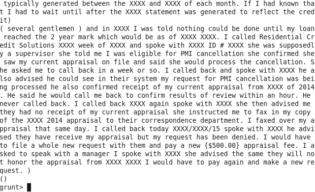
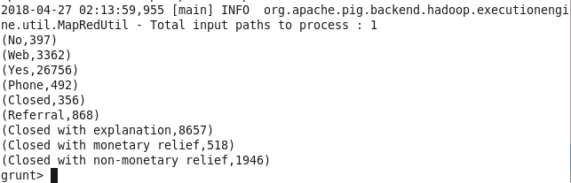
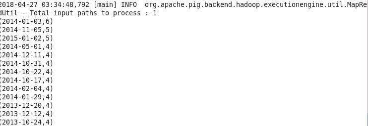

#ETL con PIG

## 1 Introducción

En esta práctica usaremos PIG para realizar consultas en un entorno distribuido Hadoop. PIG es un lenguaje creado para flujo de datos que permite especificar como captar y leer estos flujos. Es útil para: 

* ETL.
* Analizar datos en bruto.
* Procesamiento de datos iterativo. 

Las carácteristicas de PIG son que es rápido, se ha implementado sobre Hadoop pero no se re:chararraye su uso a otros sistemas, puede trabajar con cualquier flujo de datos, ofrece un gran nivel de modificación y adaptación por parte del usuario. 

## 2  Datos

La base de datos, está formada por más de 60000 registros y tiene información sobre quejas de usuarios de tarjeta de crédito en EEUU. 

[Enlace para descargar la base de datos](https://www.dropbox.com/s/jr9gae39oe2bpq6/ConsumerComplaints.csv)

## 3 Carga de Datos

Lo primero que hacemos es cargar los datos en PIG. Para ello, primero debemos de tener los datos en el HDFS.

	 hdfs dfs -put ConsumerComplaints.csv /user/impala/CD_DNI/input
	 hdfs dfs -ls /user/impala/CD_DNI/input
	 

Una vez tenemos los datos en el HDFS, los cargamos en una estructura de PIG en función del esquema.

	complaint = load
  	'/user/impala/CD_DNI/input/ConsumerComplaints.csv'
 	 using PigStorage(',') AS (DateReceived :chararray,
 	 ProductName:chararray, SubProduct:chararray,Issue:chararray,
 	 SubIssue:chararray,ConsumerComplaintNarrative:chararray, CompanyPublicResponse:chararray,
 	 Company:chararray,StateName:chararray, ZipCode:chararray, Tags:chararray,
 	 ConsumerConsentProvided:chararray, SubmittedVia:chararray, DateSenttoCompany:chararray,
 	 CompanyResponsetoConsumer:chararray, TimelyResponse:chararray, ConsumerDisputed:chararray,
 	 ComplaintID:chararray);

Para ver que todo ha funcionado correctamente:

	dump complaint;

## 4 Diseño de un experimento de datos

En este punto, realizaremos las consultas sobre la base de datos para ello, nos pondremos en lugar de un hipotético científico de datos para obtener información acerca de las quejas de los usuarios.

### Proceso exploratorio

Somos nuevos en la compañía y se nos ha contratado para analizar si las quejas de los usuarios están siendo contestadas a tiempo o no y ver como mejorar este sector de la compañia, por tanto la primera pregunta a resolver sería:

**¿Cuales son los posibles valores del campo TimelyResponse?**

Para ello, hay que ejecutar una selección de aquellos que sean distintos.

	distinct_timely_response = foreach complaint generate TimelyResponse;
	result = distinct distinct_timely_response;
	dump result;

La salida de la consulta es la siguiente:

Parece que no hemos tenido buenos resultados ya que a pesar de lo que podríamos pensar hay muchos tipos de contenido en esta tabla en lugar de respuestas a la pregunta si se ha respondido en tiempo. Vamos a intentar obtener aquellos registros más comunes, es decir, que se repitan más de 100 veces a ver si así localizamos la información buscada. Para ello, debemos responder a la pregunta:

**¿Cuales son los valores más comunes del campo TimelyResponse?**

Para esta consulta debemos hacer varias conjuntas:

	grupo  = GROUP complaint by TimelyResponse;
	cuenta = FOREACH grupo GENERATE group, COUNT(complaint.TimelyResponse) AS total;
	filtro = FILTER cuenta BY total > 300; 
	dump filtro;
	

Ahora podemos comprobar como si que hemos tenido efecto y tenemos ante nosotros las categorías más usadas dentro de esta columna, lo que nos lleva a saber que la mayoría de las quejas se cierran en tiempo, aunque hay otras que se cierran con ciertas características especiales como **Closed With Monetary Relief**. 

Por último, localizado este ítem vamos a trazar un paralelismo entre los casos cerrados con **Closed With Monetary Relief** y las fechas de cierre, para tratar de localizar si hay más quejas en periodos como después de navidad que buscan recibir el dinero de las compras de navidad y por tanto se generan quejas falsas.

Para realizar esto:

	filter_complaint = FILTER complaint BY TimelyResponse=='Closed with monetary relief';
	grupo_complaint = GROUP filter_complaint BY DateReceived;
	cuenta_fechas = FOREACH grupo_complaint GENERATE group,COUNT(filter_complaint.DateReceived) AS total;
	filtro_final = FILTER cuenta_fechas BY total > 3;
	ordenados = order filtro_final by total desc;
	dump ordenados;
	
La salida de esta consulta sería:	
	
	

Parece que no hay un patrón claro por lo que a priori podríamos descartar los fraudes. 

 

 